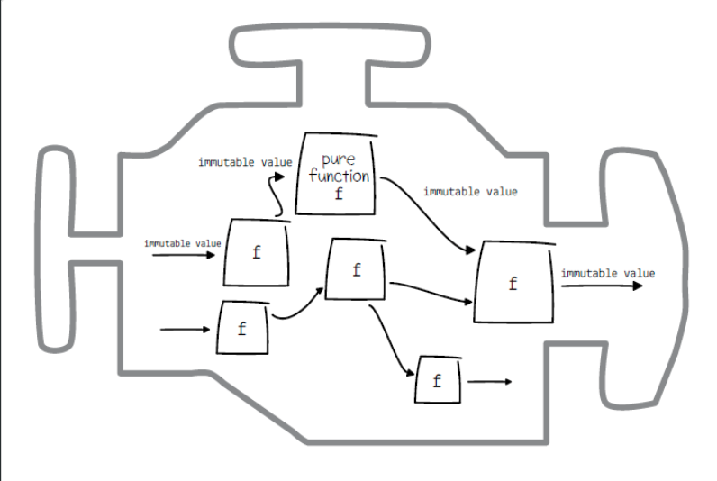

## ch 3 - Immutable Values

According to the author, functional programming is programming with pure functions that accept and return only immutable values.

immutable values are fed to pure functions which return more immutable values.

We can be sure nothing is unexpectedly mutated.

In scala, lists are immutable, with no extra work necessary

TypeScript has the `readonly` property

### OO

Shared mutable state is a building block of imperative programming.

### Encapsulation

- A technique from OO for gaurding against accidental changing of shared mutable state.
- Isolates mutable state inside object and makes it private
- mutations are done only through the object's interface
